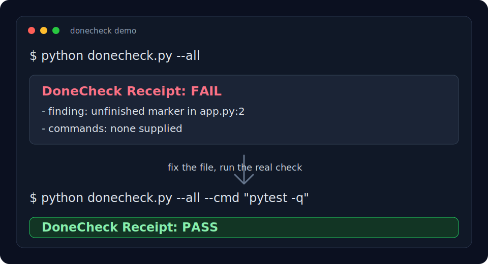

# DoneCheck

[](https://github.com/AtharvaMaik/donecheck/actions/workflows/ci.yml)
[](https://github.com/AtharvaMaik/donecheck/releases)
[](LICENSE)

Your AI coding agent says it is done. Make it prove it.

`donecheck` is a zero-dependency proof gate for AI-assisted code changes. It scans the changed files, runs the verification command you choose, and writes a small `DONECHECK.md` receipt before anyone claims the work is finished.



```bash
python donecheck.py --cmd "pytest -q"
cat DONECHECK.md
```

If there are no files and no command, it fails. No evidence, no "done".

## What It Catches

- unfinished markers and placeholder phrases in changed files
- swallowed Python exceptions and empty JavaScript catch blocks
- accidental literal secrets
- unsafe `eval` / `exec`
- failed or skipped verification commands

## 20 Second Demo

```bash
git init demo && cd demo
curl -O https://raw.githubusercontent.com/AtharvaMaik/donecheck/main/donecheck.py
printf 'def charge_card():\n    # TODO wire Stripe later\n    return True\n' > app.py
git add app.py
python donecheck.py --all
```

Output:

```text
DoneCheck: FAIL
- unfinished_marker app.py:2 # TODO wire Stripe later
```

The full receipt is in `DONECHECK.md`. Fix the file, then run:

```bash
python donecheck.py --all --cmd "python -m py_compile app.py"
```

Now the receipt says `PASS` and records the command output.

## Use It Anywhere

| Place | Command |
| --- | --- |
| Local repo | `python donecheck.py --cmd "pytest -q"` |
| Installed CLI | `pipx install git+https://github.com/AtharvaMaik/donecheck` |
| Claude Code / Codex / Cursor | Tell the agent to run DoneCheck before claiming done |
| GitHub Actions | `uses: AtharvaMaik/donecheck@v0.1.6` |

To create the GitHub Action workflow in a repo:

```bash
python donecheck.py --init --cmd "pytest -q"
```

## GitHub Action

```yaml
name: donecheck
on: [pull_request]

jobs:
  donecheck:
    runs-on: ubuntu-latest
    steps:
      - uses: actions/checkout@v4
        with:
          fetch-depth: 0
      - uses: AtharvaMaik/donecheck@v0.1.6
        with:
          command: pytest -q
```

On pull requests, the action scans the PR diff against the base branch, emits GitHub error annotations for findings, and adds the full receipt to the Actions step summary. Outside pull requests, pass `args: --all` to scan the whole repo.

## Agent Prompt

```text
Before claiming done, run:
python donecheck.py --cmd "<project test command>"

If it fails, fix the work and rerun it. Include the DONECHECK.md status in your final answer.
```

There is also a drop-in skill at `skills/donecheck/SKILL.md`.

## Launch Kit

Launching or sharing DoneCheck? Use [LAUNCH.md](LAUNCH.md) for ready-to-post Show HN, X, LinkedIn, Reddit, and community copy.

## Why It Exists

AI agents are good at sounding finished. DoneCheck makes them leave evidence:

- changed files
- findings
- commands run
- exit codes
- recent command output

It is not a full linter, security scanner, or test framework. It is the cheap first gate that catches obvious AI-code misses before a human review, CI system, or hosted review bot spends time on them.

Skipped: model-based review, AST parsing, config files, dashboards. Add those when this tiny gate stops being enough.
